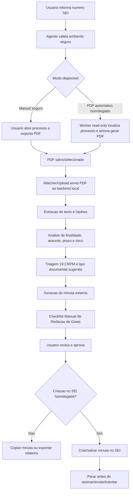

# FASE 65 - Fluxo premium da UI do Agente 19 com PDF do SEI e minuta supervisionada

Data: 2026-07-08
Status: especificacao de produto e engenharia para desenvolvimento.

## Objetivo

Desenhar o fluxo alvo do Agente 19 em uma UI moderna, onde o usuario informa o
numero do processo SEI e acompanha uma missao supervisionada completa:

1. localizar/confirmar o processo;
2. obter o PDF completo do processo;
3. analisar o PDF localmente;
4. interpretar finalidade, assunto, prazos, riscos e interesse do 19 CRPM;
5. sugerir o tipo de documento e a minuta;
6. aplicar criterios do Manual de Redacao do Governo do Estado de Goias;
7. permitir revisao/aprovacao humana;
8. criar uma minuta/documento no SEI apenas quando a fase segura estiver
   homologada;
9. parar antes de assinar, enviar, tramitar, concluir ou dar ciencia.

O agente deve parecer autonomo para o operador, mas tecnicamente deve continuar
em **autonomia supervisionada**, com guardas deterministicas, auditoria e
aprovacao humana em todos os pontos sensiveis.

## Fontes oficiais que devem orientar a fase

1. Casa Civil de Goias - Redacao Oficial / Manuais:
   https://goias.gov.br/casacivil/redacao-oficial-manuais/
   - Pagina verificada em 2026-07-08.
   - A pagina estava marcada como atualizada em 2026-06-29.
   - Ela aponta para o Novo Manual de Redacao do Governo do Estado de Goias.

2. Novo Manual de Redacao do Governo do Estado de Goias:
   https://goias.gov.br/casacivil/wp-content/uploads/sites/47/2026/03/Nova-Edicao-do-Manual-de-Redacao-do-Governo-do-Estado-de-Goias.pdf
   - Deve ser tratado como fonte normativa principal para linguagem, clareza,
     padronizacao, forma de tratamento e estrutura textual das minutas.

3. Manual do Usuario SEI 4.0+ - PEN:
   https://manuais.processoeletronico.gov.br/pt-br/latest/SEI/index.html
   - O manual possui secoes sobre operacoes com processos, documentos,
     gerar PDF/ZIP do processo, incluir documentos, editar documentos, assinar,
     excluir e cancelar.
   - Para o Agente 19, as secoes de assinatura, envio, tramitacao, ciencia,
     exclusao e cancelamento servem como **lista de perigo**, nao como permissoes.

## Validacao do sistema atual

| Capacidade desejada | Existe hoje? | Evidencia no repositorio | Observacao |
| --- | --- | --- | --- |
| UI de chat lateral no SEI | Parcial | `browser_extension/content.js` | Ja ha chat, acoes rapidas e upload manual de PDF. Precisa evoluir para cockpit premium. |
| Digitar numero SEI na UI | Parcial | `browser_extension/content.js`, `app/desktop/agent_chat.py` | Hoje o numero serve como contexto ou dispara tentativa gated de leitura; nao abre processo sozinho. |
| Agente pesquisar/abrir processo automaticamente | Nao | Testes read-only bloqueiam automacao na extensao | Deve ser fase nova, com flag, seletores homologados e guardas. |
| Gerar PDF completo do processo no SEI | Nao | `docs/60` declara fora da fase atual | Deve ser implementado como automacao read-only homologada ou permanecer manual no MVP. |
| Salvar PDF na pasta Downloads | Nao | Nao ha watcher de Downloads nem worker de exportacao | Deve haver contrato local explicito, sem acessar credenciais. |
| Pegar PDF salvo e analisar | Parcial | `app/intake/pdf_upload.py`, `app/intake/pdf_pipeline.py` | Hoje analisa PDF enviado/selecionado pelo usuario. Falta watcher e associacao automatica com processo. |
| Entender finalidade do processo | Parcial | `app/intelligence/mission_control.py`, `institutional_analyzer.py`, `local_triage.py` | Ja ha analise/triagem, mas precisa regra especifica de finalidade + evidencias por folha/documento. |
| Informar resultado com excelencia | Parcial | `mission_control`, `agent_readiness` | Falta UI de evidencias, score de confianca por achado e checklist de redacao. |
| Sugerir documento/minuta | Sim, externo | `local_minutador.py`, templates em `knowledge_base/templates_minutas` | Hoje e rascunho externo para copiar/revisar. |
| Aplicar Manual de Redacao de Goias | Nao completo | Nao ha avaliador dedicado do manual | Deve criar `redacao_goias_policy` e testes de conformidade. |
| Criar documento/minuta no SEI apos aprovacao | Nao em producao | `MinutaWriter` simula; real levanta `NotImplementedError` | Fase 5B/5D ainda exige homologacao, token e autorizacao expressa. |
| Assinar/enviar/tramitar | Proibido | `permissions.py`, `sei_action_guard.py`, testes | Deve continuar permanentemente bloqueado. |

Conclusao: o sistema **ainda nao faz** o fluxo completo pedido. Ele tem a base
correta para evoluir: UI inicial, PDF intake, mission control, minuta local,
guardas, auditoria e simulacao de minuta. A proxima fase deve transformar isso
em fluxo premium sem quebrar a regra-mae.

## Regra-mae da fase

O Agente 19 pode ir ate **criar/salvar uma minuta revisavel**, quando e somente
quando a fase real estiver homologada. Ele nunca pode:

1. assinar;
2. tramitar;
3. enviar processo;
4. concluir processo;
5. dar ciencia automatica;
6. excluir/cancelar documento;
7. liberar acesso externo;
8. conceder credencial;
9. armazenar senha, cookie, token ou sessao do SEI.

## Experiencia alvo: UI "Mission Control"

A UI deve ser uma tela de trabalho, nao uma landing page. O usuario abre e ja
entra no cockpit operacional.

### Layout

1. Barra superior:
   - status do backend local;
   - status do SEI;
   - modo de seguranca: `Somente leitura`, `Revisao humana`, `Atos oficiais bloqueados`;
   - botao de auditoria/trace.

2. Coluna esquerda: entrada da missao
   - campo `Numero do processo SEI`;
   - botao `Iniciar missao`;
   - seletor de modo:
     - `Manual seguro`;
     - `PDF automatico homologado`;
     - `Criar minuta homologada`;
   - campo opcional `Unidade destino`;
   - campo opcional `Tipo de documento`.

3. Centro: linha do tempo da missao
   - `Validando ambiente`;
   - `Aguardando login humano no SEI`;
   - `Confirmando processo`;
   - `Gerando PDF`;
   - `Lendo Downloads`;
   - `Extraindo texto`;
   - `Analisando finalidade`;
   - `Aplicando Manual de Redacao`;
   - `Gerando minuta`;
   - `Aguardando aprovacao humana`;
   - `Criando minuta no SEI` ou `Copiar manualmente`;
   - `Finalizado sem ato oficial`.

4. Coluna direita: evidencias e minuta
   - cards de documentos/folhas encontrados;
   - finalidade provavel;
   - assunto;
   - prazos;
   - riscos;
   - unidade sugerida;
   - tipo documental sugerido;
   - minuta editavel;
   - checklist do Manual de Redacao de Goias;
   - checklist SEI antes de criar documento.

5. Rodape fixo:
   - `Aprovar minuta`;
   - `Pedir revisao`;
   - `Exportar relatorio`;
   - `Copiar minuta`;
   - `Criar minuta no SEI` somente quando permitido por flag, homologacao e token.

### Estados obrigatorios

| Estado | UX esperada | Acao tecnica |
| --- | --- | --- |
| `idle` | Campo de processo em foco | Nenhuma automacao |
| `waiting_login` | Mostra que login e manual | Abre/observa SEI sem credenciais |
| `process_confirmed` | Numero confirmado em destaque | Compara numero pedido x aberto |
| `pdf_export_pending` | Mostra instrucao ou progresso | Manual no MVP; automatico so na fase homologada |
| `pdf_downloaded` | Nome, hash e horario do PDF | Downloads watcher associa ao processo |
| `analysis_running` | Timeline com spinner e etapas | PDF intake + mission control |
| `draft_ready` | Minuta em editor revisavel | Redacao + minuta local |
| `human_review` | Checklist bloqueante | Usuario revisa e confirma |
| `approved` | Token de aprovacao emitido | Hash do texto + processo + tipo |
| `sei_minuta_simulated` | Simulacao executada | Sem escrita real |
| `sei_minuta_created` | Minuta salva, sem assinar | Apenas fase homologada |
| `blocked` | Explica motivo | Guard bloqueou |

## Fluxo alvo



## Modos de operacao

### Modo 1 - Manual seguro (deve ser o primeiro a implementar na nova UI)

1. Usuario informa o numero SEI.
2. UI pede que o usuario abra o processo no SEI e gere o PDF pelo proprio SEI.
3. Usuario arrasta o PDF ou seleciona da pasta Downloads.
4. Agente analisa PDF, gera relatorio e minuta.
5. Usuario revisa e copia para o SEI.

Este modo ja combina bem com a base atual e preserva a seguranca.

### Modo 2 - PDF automatico homologado

So pode existir depois de uma nova homologacao de seletores e testes.

Regras:

1. flag `ENABLE_SEI_PDF_EXPORT_AUTOMATION=false` por padrao;
2. manifesto `knowledge_base/sei_homologacao/pdf_export_selectors.json`;
3. navegador efemero;
4. login sempre manual;
5. sem leitura de cookie, token, senha ou storage;
6. processo aberto precisa bater com o numero informado;
7. operacao permitida apenas para `GERAR_PDF_PROCESSO`;
8. nenhum seletor de assinatura, envio, tramitacao, ciencia, conclusao,
   cancelamento ou exclusao pode existir no manifesto;
9. PDF precisa ser salvo com hash e associado ao processo;
10. se algo divergir, o fluxo cai para modo manual seguro.

### Modo 3 - Criacao de minuta no SEI homologada

So pode existir depois da Fase 5B/5D aprovada.

Regras:

1. flag `ENABLE_MINUTA_CREATION=false` por padrao;
2. usar apenas `MinutaWriter` como chokepoint;
3. exigir token amarrado a:
   - processo confirmado;
   - tipo de documento existente;
   - hash do texto final revisado;
   - usuario local;
4. criar/salvar minuta e parar;
5. nunca assinar, enviar, tramitar ou concluir;
6. auditoria deve gravar apenas metadados e hashes, nunca texto integral.

## Componentes tecnicos a desenvolver

### Frontend

1. `AgentMissionCockpit`
   - cockpit principal;
   - chat + timeline + evidencias + editor de minuta.

2. `ProcessNumberInput`
   - normaliza numero SEI;
   - valida formato;
   - impede inicio sem confirmacao.

3. `MissionTimeline`
   - mostra etapas, status, erros e bloqueios.

4. `PdfSourcePanel`
   - drag-and-drop;
   - botao `Selecionar PDF`;
   - em fase futura, mostra watcher de Downloads.

5. `EvidencePanel`
   - lista achados por documento/folha;
   - mostra fonte, confianca e trecho curto sanitizado.

6. `DraftReviewEditor`
   - minuta editavel;
   - diffs;
   - checklist de redacao;
   - botao `Aprovar`.

7. `GuardrailBanner`
   - sempre visivel;
   - informa que atos oficiais ficam fora.

### Backend

1. `app/agent/mission_flow.py`
   - orquestra estados da missao.

2. `app/sei/pdf_exporter.py`
   - futuro worker de exportacao read-only;
   - deve ser stub no primeiro PR.

3. `app/intake/download_watcher.py`
   - observa Downloads local quando autorizado;
   - aceita somente PDF;
   - associa por horario, nome e hash;
   - nunca envia arquivo para fora.

4. `app/intelligence/process_purpose.py`
   - identifica finalidade do processo;
   - retorna `finalidade`, `assunto`, `fundamento`, `prazo`, `risco`,
     `evidencias`.

5. `app/intelligence/redacao_goias_policy.py`
   - aplica regras do Manual de Redacao de Goias;
   - valida clareza, concisao, padronizacao, forma de tratamento,
     estrutura, fecho e assinatura esperada;
   - nao inventa autoridade nem cargo.

6. `app/intelligence/draft_reviewer.py`
   - revisa a minuta contra:
     - PDF;
     - finalidade;
     - knowledge base 19 CRPM;
     - Manual de Redacao de Goias;
     - regras SEI.

7. `app/agent/approval_token.py`
   - token de aprovacao de missao;
   - diferente do token de minuta, mas pode reutilizar padrao de hash.

## Contratos propostos

### Start mission

```json
{
  "processo_sei": "202600000000000",
  "modo": "manual_seguro",
  "usuario_local": "operador.local",
  "unidade_destino": "PM/19 CRPM",
  "tipo_documento_preferido": ""
}
```

### Mission state

```json
{
  "mission_id": "mis_...",
  "status": "draft_ready",
  "etapa_atual": "aplicando_manual_redacao_goias",
  "processo_confirmado": true,
  "pdf": {
    "filename": "processo_202600000000000.pdf",
    "file_hash": "sha256...",
    "page_count": 42,
    "status_leitura": "lido"
  },
  "resultado": {
    "finalidade": "apurar e encaminhar demanda administrativa",
    "assunto": "apoio operacional",
    "prazo": "2026-07-20",
    "providencia_sugerida": "elaborar despacho de encaminhamento",
    "tipo_documento_sugerido": "Despacho"
  },
  "evidencias": [
    {
      "documento": "Oficio inicial",
      "folha": "estimada pelo PDF",
      "trecho_sanitizado": "solicita apoio operacional...",
      "confianca": 0.86
    }
  ],
  "redacao_goias": {
    "ok": false,
    "pendencias": ["confirmar forma de tratamento", "ajustar fecho"]
  },
  "revisao_humana_obrigatoria": true,
  "acoes_bloqueadas": [
    "ASSINAR_DOCUMENTO",
    "ENVIAR_PROCESSO",
    "TRAMITAR_PROCESSO",
    "CONCLUIR_PROCESSO",
    "DAR_CIENCIA_AUTOMATICA"
  ]
}
```

### Approval

```json
{
  "mission_id": "mis_...",
  "processo_sei": "202600000000000",
  "tipo_documento": "Despacho",
  "texto_final": "texto revisado pelo humano",
  "aprovado_por": "operador.local",
  "confirmacoes": {
    "li_pdf": true,
    "conferi_finalidade": true,
    "conferi_redacao_goias": true,
    "sei_sem_assinatura_envio_tramitacao": true
  }
}
```

## Checklist do Manual de Redacao de Goias

O desenvolvimento deve transformar o manual oficial em uma policy testavel.
Sem copiar texto longo do manual para o repositorio, a IA deve consultar a fonte
oficial e salvar apenas regras resumidas e citacoes de referencia.

Checklist minimo:

1. finalidade do documento esta clara;
2. texto e impessoal;
3. linguagem e clara, objetiva e concisa;
4. assunto esta adequado ao tipo documental;
5. forma de tratamento esta adequada;
6. estrutura do documento esta completa;
7. fecho esta adequado;
8. nao ha promessa de ato que o agente nao pode praticar;
9. nao ha assinatura simulada;
10. nao ha numero/data inventados;
11. campos pendentes estao marcados com placeholder;
12. minuta pode ser revisada por humano antes de uso.

## Criterios de aceite 10/10

1. Usuario informa numero SEI e ve timeline clara de toda a missao.
2. Se automacao de PDF nao estiver homologada, UI orienta modo manual sem erro.
3. Se PDF for anexado/baixado, backend extrai texto, hash e paginas.
4. Texto integral do processo nao e persistido por padrao.
5. Finalidade do processo vem com evidencias e confianca.
6. Minuta e gerada com tipo documental sugerido e campos pendentes explicitos.
7. Checklist do Manual de Redacao de Goias aparece antes da aprovacao.
8. Botao de criar minuta no SEI so aparece quando:
   - flag ligada;
   - seletores homologados;
   - processo confirmado;
   - token valido;
   - revisao humana concluida.
9. Criacao real, quando existir, para apos salvar minuta.
10. Assinar/enviar/tramitar/concluir/ciencia continuam bloqueados em testes.
11. CI executa testes, scanner de segredos, agent evals e premium readiness.
12. UI funciona em 1366x768 e mobile/tablet sem sobrepor textos.

## Testes obrigatorios antes de implementar a automacao real

1. `test_ui_mission_cockpit_fluxo_manual_pdf`
2. `test_download_watcher_aceita_apenas_pdf_e_hash`
3. `test_pdf_exporter_desligado_por_padrao`
4. `test_pdf_exporter_nao_le_cookie_token_storage`
5. `test_pdf_exporter_bloqueia_seletor_de_ato_oficial`
6. `test_process_purpose_exige_evidencia`
7. `test_redacao_goias_policy_marca_pendencias`
8. `test_approval_token_falha_se_texto_mudar`
9. `test_minuta_real_continua_not_implemented_sem_homologacao`
10. `test_criar_minuta_para_antes_de_assinar`

## Backlog recomendado

### PR 1 - UI Mission Control manual seguro

1. Criar cockpit moderno no painel local.
2. Usar upload/drag-and-drop de PDF.
3. Exibir timeline, evidencias, minuta e checklist.
4. Sem automacao no SEI.

### PR 2 - Interpretador de finalidade com evidencias

1. Criar `process_purpose.py`.
2. Retornar finalidade + evidencias.
3. Testar com PDFs anonimizados/ficticios.

### PR 3 - Policy do Manual de Redacao de Goias

1. Criar `redacao_goias_policy.py`.
2. Criar regras resumidas em knowledge base.
3. Testar despacho/oficio/informacao/encaminhamento.

### PR 4 - Watcher de Downloads

1. Monitorar pasta Downloads somente com permissao local.
2. Associar PDF ao processo.
3. Nunca processar arquivos fora de PDF.

### PR 5 - Exportacao PDF SEI homologada

1. Criar manifesto de seletores.
2. Implementar worker read-only em arquivo permitido.
3. Testar contra pagina fake do SEI.
4. Exigir flag desligada por padrao.

### PR 6 - Criacao controlada de minuta no SEI

1. Evoluir Fase 5B/5D.
2. Usar `MinutaWriter`.
3. Salvar minuta e parar.
4. Manter atos oficiais bloqueados.

## Decisao de arquitetura

O caminho certo nao e colocar um agente solto clicando no SEI. O caminho premium
e uma missao supervisionada com:

1. UI excelente;
2. estados explicitos;
3. guardas deterministicas;
4. evidencias;
5. aprovacao humana;
6. automacao minima, homologada e reversivel;
7. auditoria por hash;
8. testes bloqueantes.

Assim o operador sente que o agente "faz tudo", mas o sistema continua seguro,
auditavel e compativel com o uso responsavel do SEI.
